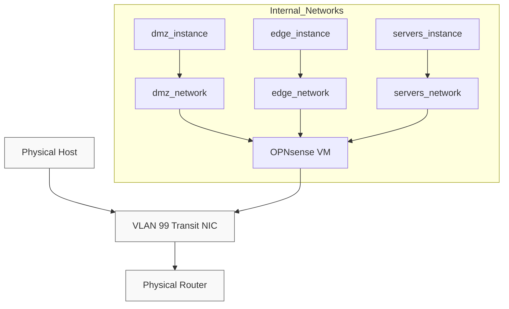

If you're like me, you enjoy self hosting your own services for fun and the joy of learning. As long as you don't expose your services to the wild west that is the open internet, you're probably fine without thinking too much about security.

In my case however, I do have services I expose, or want to expose to the internet. So what can I do to lock down my services tighter than Fort Knox?

Currently I'm running Incus on Debian as my container manager and hypervisor. It's quite a flexible tool and recently I discovered it exposes a "port_isolation" configuration key, which stops the container/VM from talking to any other container/VM with that key set.

That made me realize I could create Incus profiles that would make sure that option is set on all my containers and VMs, and then only on my firewall would I skip it. This way, whenever one of my containers needs to talk to another, it's forced to go through my OPNsense VM which acts as a router/firewall internally.

## Design Overview

In this design, all Incus instances sit on virtual bridge interfaces but are prevented from talking directly to each other by the `port_isolation` profile. Only the OPNsense VM has unrestricted access to those bridges, acting as the DHCPv4 server and gateway. By assigning each container a /32 mask, we ensure all traffic is forced through the firewall VM for routing and policy enforcement.



## Implementation

## Creating the Isolation Profile

So first of all, let's create a profile to do this with:

```yaml
name: servers
description: ''
devices:
  eth0:
    network: servers
    security.mac_filtering: 'true'
    security.port_isolation: 'true'
    type: nic
  root:
    path: /
    pool: default
    size: 10GiB
    type: disk
config:
  limits.cpu: '4'
  limits.memory: 3GiB
  security.nesting: 'true'
  security.secureboot: 'false'
  boot.autostart: 'true'
project: default
```

Now, I've included the whole profile I'm using, so please adapt it as necessary for your needs. All you need to make this work is `security.port_isolation: 'true'` on your eth0 interface. I'd also recommend enabling `security.mac_filtering` as shown, this way the instance will not be able to try and communicate with another MAC address than it's been assigned.

## Firewall VM Configuration

For my firewall VM, all I need to do is directly assign it to the networks, e.g.:

```yaml
eth3:
    network: servers
    type: nic
```

Once the profiles are in place, the next challenge appears. How do we make sure the instances won't try to connect directly to each other, since they're on paper in the same subnet?

There are a few options here, what I went with however was handing out DHCP leases from the OPNsense VM.

"But won't that hand out leases covering the whole subnet and we'll be right back where we started?" I hear you ask. If you have a /24 subnet on the applicable interface, then yes, by default the DHCP server would hand out the /24 subnet.

So how do we solve this? It was a bit of a headache, because as it turns out not all DHCP server implementations allows you to do so.

The more modern ISC Kea for example, does however not allow you to override option 1, so to make that work you'd need to patch out that restriction – not great.

## DHCP /32 Mask Trick

The workaround I found for this problem, is enable the advanced options for ISC DHCPv4 server instead, add option 1 (subnet mask) and set it to `255.255.255.255`. In this way, the client will set `<IP address>/32` on the instance, and all traffic will be forced through the firewall:


I'd recommend using static DHCP mappings for each instance and enabling `Deny unknown clients`, so that only containers and VMs you've explictly allowed gets assigned an IP. You might also consider enabling `Enable Static ARP entries`, this will only allow devices listed in the static mappings to communicate with that OPNsense interface at all (so be careful not to lock yourself out). 

Once you're done with the DHCP server you might need to do a `ifdown eth0; ifup eth0` in your instance before the new lease takes effect.

## Verification and Testing

If you now enter your instance's terminal and check the network config:
```bash
nextcloud:~$ ip -4 a show dev eth0
85: eth0@if86: <BROADCAST,MULTICAST,UP,LOWER_UP> mtu 1500 qdisc noqueue state UP group default qlen 1000
    link/ether 11:22:33:44:55:66 brd ff:ff:ff:ff:ff:ff link-netnsid 0
    inet 10.2.0.2/32 scope global eth0
       valid_lft forever preferred_lft forever

nextcloud:~$ ip r show dev eth0
default via 10.2.0.1 metric 285
10.2.0.1 scope link
```

You should see that it's gotten a /32 address assigned, and you've got a link scope route for the gateway so the kernel knows it's available.

If you have multiple instances on the same Incus network already, I'd recommend trying to ping between them and verifying that they're not able to. Once you've confirmed that, you can try to add an ICMP rule to allow them to talk in OPNsense and then try ping again. If it then goes through, you've done it correctly.

As a bit of an addmendum, on paper you only _need_ one Incus network when you do things this way, as your instances won't be able to talk with each other directly regardless. However I personally have a couple extra networks which lets me organize my rules a bit better. Currently I have `DMZ`, `Edge` and `Servers`. Services I particularly don't trust goes in `DMZ`, my reverse proxies goes in `Edge` and anything else goes in `Servers`.

## Conclusion

By combining Incus’s `port_isolation` profile with a `/32` subnet mask via OPNsense’s ISC DHCPv4 server, you force all container-to-container traffic through a single firewall VM. This approach simplifies microsegmentation, reduces lateral-movement risk, and centralizes network policy enforcement. You can extend it further with VLANs or per-host rules right in OPNsense’s GUI.

## TL;DR

- **Profile**: Create an Incus profile with `security.port_isolation: 'true'` on your bridge NIC.
- **Firewall VM**: Don’t attach that profile to your OPNsense VM.
- **DHCPv4 Trick**: In OPNsense’s DHCPv4 advanced options, override option 1 (subnet-mask) to `255.255.255.255`.
- **Apply**: Restart the DHCP client on each container so they pick up a `/32` lease.
- **Verify**: Each container shows `inet x.y.z.a/32` and can only talk to the gateway MAC.

